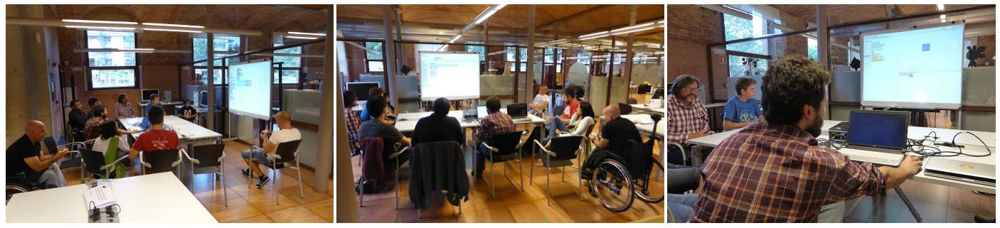

# 29 Setembre 2015,1a Sessió Club Programació

10 participants. El més petit 10 anys, els més grans van jugar al [Asteroids](https://en.wikipedia.org/wiki/Asteroids_%28video_game%29) de petits.

La tercera part tenen pocs coneixments de programació, però moltes ganes d’aprendre.

La meitat mostren interès en el tema de la creació de Jocs.

Per part del Citilab comencen amb:

Introducció a la programació per blocs amb Scratch

Amb l’Snap! podem anar encara més lluny!.  Demo sobre funcions i recursivitat amb Snap! (Sierspinky) i  entorn dinàmic amb una sínia interactiva amb 0 línies de codi.

En “primícia mundial” mostren GP (General Purpose/ Guinea Pig) llenguatge de programació per blocs, dinàmic i de propòsit general, en versió alfa. Es proposa formar un grup de testeig per ajudar als desenvolupadors a millorar-lo.

Mostrem un dels jocs creat a la GameJam de la JamToday (Fruit vs trash-food) i veiem un que ens proposa la Rita,  per demostrar que en Scratch es podem fer coses interessants [Hill Climb Racing](https://scratch.mit.edu/projects/56667360/).

Dels projectes inicials i de les propostes dels participants surten 3 línies de treball.

##Jocs##

    Exploració de diferents entorns de creació de Jocs. Scratch, phaser.io, pixi.js, love with Lua, Unity, Stencyl, …

    Construir un parell de jocs per aprofitar aquesta recerca.

    Documentar “snippets” que es pugin fer sevir per crear nous jocs.

##Crear una història interactiva amb Scratch##. La base serà una nova forma d’explicar l’increible món dels diftongs i els hiats.

##Programar una rellotge de sol per interiors##, amb sintetitzador de veu  per donar alarmes i avisos. Segurament es farà una versió “maker” els dijous.

El dimarts 6 ens emplacen per començar a crear els grups per cadascun dels projectes. Nous membres dels clubs són benvinguts/es!

Per acabar uns  quants enllaços sobre formació, programació i pensament computacional, compartits pels membres del club:

[Dr. Scratch](http://drscratch.programamos.es/), per analitzar algunes característiques dels projectes d’Scratch

Moocs sobre robòtica [MoocBot](http://drscratch.programamos.es/) i pensament computacional [Miriadax](https://miriadax.net/web/pensamiento-computacional-en-la-escuela-2ed)

